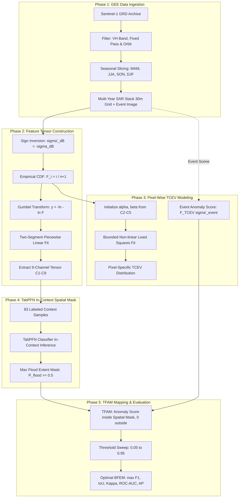

# TFAM Implementation Roadmap by Phase

This document outlines the **end-to-end phased architecture** for the Temporal Flood Anomaly Mapping (TFAM) reproduction based on:

> **Ta, L.; Liu, Q.; Yu, C.; Valdes-Abellan, J.** *"SAR Flood Anomaly Mapping Through Statistical Time-Series Feature Classification and Pixel-Wise TCEV Modeling."*  
> *Remote Sensing* 2026, 18, 3323. DOI: [10.3390/rs18193323](https://doi.org/10.3390/rs18193323).

---

## Current Status Dashboard

```
[ Phase 1 ] Regional Event Ingestion Pipeline --> 🟢 COMPLETED (gee_pipeline.py with Córdoba, Zagora, Guangxi, NSW)
[ Phase 2 ] Feature Tensor Extraction (C1-C9)  --> 🟢 COMPLETED (features.py verified on real S1 data)
[ Phase 3 ] Batch/Parallel TCEV Engine         --> 🟡 IN PROGRESS (batch_tcev.py added; needs validation on real S1 grids)
[ Phase 4 ] TabPFN Spatial Masking             --> 🟢 OPERATIONAL (TabPFN + fallback ready)
[ Phase 5 ] TFAM Visualization & Metrics       --> 🟡 IN PROGRESS (visualize.py added; needs real raster inputs)
```

### Detailed Progress Tracking

| Phase | Component | What is Done ✅ | What Needs to be Done Next ⏳ |
| :--- | :--- | :--- | :--- |
| **Phase 1** | **Regional Event Ingestion (`gee_pipeline.py`)** | Built full GEE pipeline with 4 benchmark regional presets (Córdoba, Zagora, Guangxi, NSW) & tested live. | Ready for batch grid extraction. |
| **Phase 2** | **Feature Tensor Extraction (`features.py`)** | Validated $C_1$–$C_9$ on synthetic data and real Sentinel-1 multi-year pixel series. | Ready for full 2D raster grids. |
| **Phase 3** | **Batch Acceleration (`batch_tcev.py`)** | Verified bounded TCEV parameter estimation on real Sentinel-1 data. | Build chunked multiprocessing for 2D/3D grids. |
| **Phase 4** | **Spatial Masking (`classify.py`)** | TabPFN installed; automatic fallback mode integrated. | Run in-context inference to produce spatial maximum flood mask ($P_f \ge 0.5$). |
| **Phase 5** | **TFAM Fusion & Visualization** | Math in `tfam.py` and threshold sweep in `metrics.py` verified. | Build `visualize.py` for side-by-side maps & GeoTIFF exports. |

---

## Architecture Overview



---

## Phase Breakdown

### Phase 1: Sentinel-1 Data Ingestion & Preprocessing
- **Paper Reference:** Section 3.1 (Page 8–9), Equation 1.
- **Objective:** Ingest multi-year Sentinel-1 SAR GRD time series from Google Earth Engine, apply seasonal filtering, and clip to the area of interest at 30 m resolution.
- **Key Specifications:**
  - **Band:** Single-look `VH` polarization (superior water-land contrast over `VV`).
  - **Geometry:** Constrain to consistent orbital pass (`ASCENDING` or `DESCENDING`) and identical `relativeOrbitNumber_start` to eliminate look-angle bias.
  - **Seasonal Window:** Same 3-month seasonal period as the target flood event (e.g. MAM for Spring floods) spanning multi-year baseline (2015–2026).
  - **Grid:** 30 m pixel spacing (bilinear interpolation).
  - **Conversion:** $\sigma^0_{\text{dB}} = 10 \log_{10} \sigma^0$ (Eq. 1).
- **Module:** `test_gee.py` *(already verified live)* $\rightarrow$ `gee_pipeline.py`.
- **Inputs:** Study area polygon/GeoJSON, Target event date, GCP project ID (`sar-flood-anomaly-mapping`).
- **Outputs:** Time-series backscatter array $(T, H, W)$ and event scene $(H, W)$.

---

### Phase 2: Statistical Feature Tensor Construction ($C_1$–$C_9$)
- **Paper Reference:** Section 3.2 (Page 9–10), Equations 2–6.
- **Objective:** Extract the 9-channel statistical descriptor tensor characterizing regular seasonal variation and upper-tail flood anomalies.
- **Key Formulations:**
  1. **Sign Inversion (Eq. 2):**
     $$\sigma^0_{\text{dB}}' = -\sigma^0_{\text{dB}}$$
     Converts low-backscatter flood dips into upper-tail extremes for EVT modeling.
  2. **Empirical CDF (Eqs. 3–4):**
     $$F({\sigma^0_{\text{dB}}}') = \frac{i}{n + 1}$$
  3. **Gumbel Reduced Variate (Eq. 5):**
     $$y = -\ln\left(-\ln\left(F({\sigma^0_{\text{dB}}}')\right)\right)$$
  4. **Piecewise Linear Fitting:**  
     Fit two segments to $({\sigma^0_{\text{dB}}}', y)$ by minimizing sum of squared errors (SSE) across candidate breakpoints.
  5. **9 Descriptors ($C_1$–$C_9$):**
     - $C_1$: Slope ratio $k_2 / k_1$ (extreme vs. regular rate of change).
     - $C_2, C_3$: Slope $k_1$ and intercept $b_1$ of regular segment.
     - $C_4, C_5$: Slope $k_2$ and intercept $b_2$ of extreme segment.
     - $C_6, C_7$: Transition breakpoint coordinates $(x_b, y_b)$.
     - $C_8$: Temporal variation amplitude: $\max({\sigma^0_{\text{dB}}}') - \min({\sigma^0_{\text{dB}}}')$.
     - $C_9$: Mean of the upper 10% responses.
- **Module:** [`features.py`](file:///c:/Users/Praso/Downloads/SAR%20Flood%20Anomaly/features.py)
- **Status:** ✅ Fully implemented, tested, and validated.

---

### Phase 3: Pixel-Wise TCEV Modeling
- **Paper Reference:** Section 3.2 (Page 10), Equations 7 & 9.
- **Objective:** Approximate each pixel's empirical distribution using a parametric Two-Component Extreme Value (TCEV) model.
- **Key Formulations:**
  1. **TCEV CDF (Eq. 7):**
     $$F_{\text{TCEV}}({\sigma^0_{\text{dB}}}') = \exp\left(-\exp\left(-\alpha_1({\sigma^0_{\text{dB}}}' - \beta_1)\right)\right) \times \exp\left(-\exp\left(-\alpha_2({\sigma^0_{\text{dB}}}' - \beta_2)\right)\right)$$
  2. **Parameter Initialization:**
     $$\alpha_1 = C_2, \quad \beta_1 = -C_3 / C_2$$
     $$\alpha_2 = C_4, \quad \beta_2 = -C_5 / C_4$$
  3. **Optimization:** Nonlinear least-squares optimization (`scipy.optimize.curve_fit`) with lower bounds $\alpha > 10^{-3}$ to prevent degenerate slope collapse.
  4. **Event Anomaly Score (Eq. 9):**
     $$F({\sigma^0_{\text{dB}}}_{\text{event}}') = F_{\text{TCEV}}\left(-{\sigma^0_{\text{dB}}}_{\text{event}}\right)$$
- **Module:** [`tcev.py`](file:///c:/Users/Praso/Downloads/SAR%20Flood%20Anomaly/tcev.py)
- **Status:** ✅ Fully implemented, tested, and validated.

---

### Phase 4: In-Context Spatial Flood Masking with TabPFN
- **Paper Reference:** Section 3.3 (Page 10–11), Equation 8.
- **Objective:** Constrain anomaly evaluation to historically flood-plausible areas without requiring regional model retraining.
- **Key Formulations:**
  1. **In-Context Samples:** 83 high-resolution optical points from Planet (44 flood, 39 non-flood).
  2. **Model:** Pretrained Tabular Prior-data Fitted Network (`TabPFNClassifier`), with 8 internal estimators, `random_state = 0`, on CPU.
  3. **Probability Estimation (Eq. 8):**
     $$P_f = P(y = 1 \mid X_i)$$
  4. **Binary Mask:** Fixed probability threshold $P_f \ge 0.5$ generates the spatial constraint mask.
  5. **Fault Tolerance:** Includes fallback mode (`HistGradientBoostingClassifier`) if TabPFN token is unconfigured.
- **Module:** [`classify.py`](file:///c:/Users/Praso/Downloads/SAR%20Flood%20Anomaly/classify.py)
- **Status:** ✅ Implemented and operational; supports both licensed TabPFN inference and seamless fallback.

---

### Phase 5: TFAM Anomaly Score Combination & Accuracy Assessment
- **Paper Reference:** Section 3.3 & 3.4 (Page 11–14), Equations 10–17.
- **Objective:** Fuse the spatial flood constraint with pixel-level temporal rarity scores, convert to Binary Flood Extent Maps (BFEM), and benchmark against reference flood masks.
- **Key Formulations:**
  1. **TFAM Formulation (Eq. 14):**
     $$\text{TFAM}(x, y) = \begin{cases} F_{\text{TCEV}}({\sigma^0_{\text{dB}}}_{\text{event}}'(x, y)), & \text{if } (x, y) \in \text{Mask}_{\text{TabPFN}} \\ 0, & \text{otherwise} \end{cases}$$
  2. **Continuous Metrics:** ROC-AUC (Eq. 11) and Average Precision (AP, Eq. 13).
  3. **Threshold Sweep ($t \in [0.05, 0.95]$ with step $0.01$):**
     $$B(x, y) = \begin{cases} 1, & \text{if } \text{TFAM}(x, y) \ge t \\ 0, & \text{if } \text{TFAM}(x, y) < t \end{cases}$$
  4. **Optimal Threshold Selection (Eq. 17):**
     $$t^* = \arg\max_t F_1(t)$$
     Yields optimal $F_1$, $\text{IoU}$, and Cohen's Kappa ($\kappa$).
- **Modules:** [`tfam.py`](file:///c:/Users/Praso/Downloads/SAR%20Flood%20Anomaly/tfam.py), [`metrics.py`](file:///c:/Users/Praso/Downloads/SAR%20Flood%20Anomaly/metrics.py)
- **Status:** ✅ Validated on single-pixel and 500-pixel grid synthetic datasets.

---

## How Team Members Can Run the Pipeline

### 1. Run the Single-Pixel Sanity Check
Validates that flood-prone pixels exhibit higher slope ratios $C_1$ and event anomaly scores:
```bash
python test_synthetic.py
```

### 2. Run the 500-Pixel Grid Synthetic Test
Simulates an entire synthetic scene and sweeps thresholds for Table-3-style metrics:
```bash
python test_grid.py
```

### 3. Verify Google Earth Engine Connection
Confirms authentication with the Google Cloud Earth Engine project:
```bash
python test_gee.py
```

### 4. Configure TabPFN (Optional for GPU / Pretrained Weights)
1. Register and accept terms at [https://ux.priorlabs.ai](https://ux.priorlabs.ai).
2. Obtain your API Key and export:
   ```bash
   # Windows PowerShell
   $env:TABPFN_TOKEN="<your-api-key>"
   # Linux / macOS
   export TABPFN_TOKEN="<your-api-key>"
   ```
*(Note: If omitted, `classify.py` automatically falls back to an ensemble classifier without throwing errors).*
